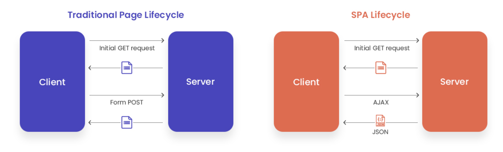
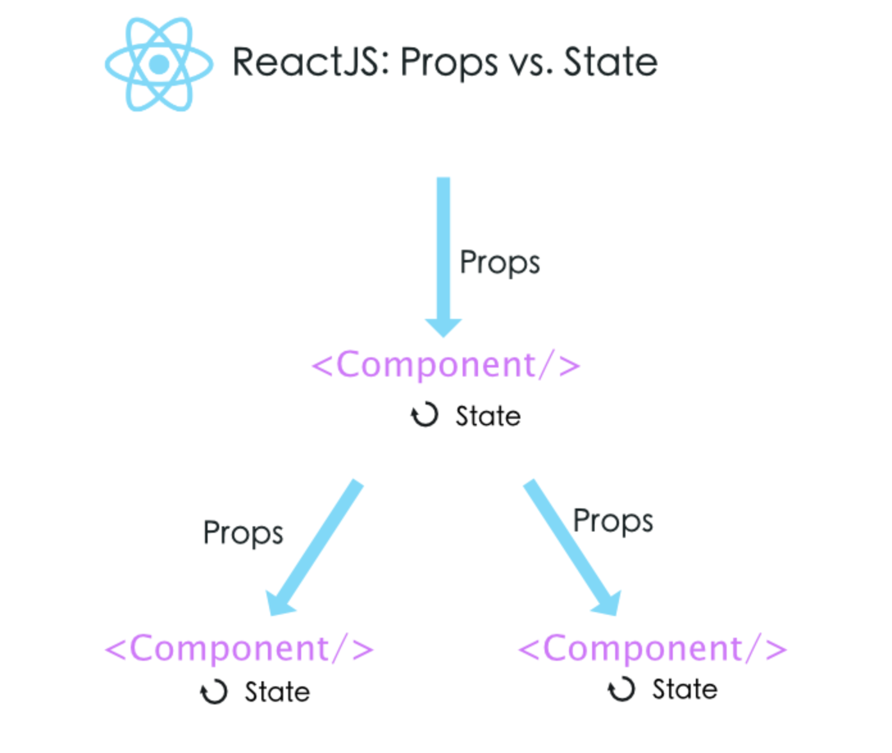

# React101

> Learn react and make movie-app with nomadcoders 🚀

> This repo is react basic course. So I will summarize `react basic concept(a.k.a must know concept)` here.

> This is written based on [NomadCoders React Fundemental Course](https://nomadcoders.co/react-fundamentals) and [React Official Site](https://ko.reactjs.org/)

> [DEMO](https://jjanmo.github.io/react101)

## Chapter00 : What is npx?

> npm이라고 하면 `Node Package Manager`라고하여 패키지 관리하는 도구이다. 하지만 **npx는 패키지 관리 도구가 아니다.** npm에서 제공해주는 새로운 도구이다. npm을 좀 더 편하게 사용할 수 있게 해주는 도구로서 npm을 통해서 설치하는 패키지를 npx를 통해서 쉽게 설치하고 실행할 수 있게 도와준다.

`npx의 등장 배경`

npm으로 패키지를 설치할 때, 전역적으로 설치하여 관리하는 경우와 로컬에 프로젝트별로 설치해서 관리하는 경우가 있을 수 있다. 이 때 패키지의 버전관리가 문제가 생길 수 있다. 자바스크립트의 생태계의 빠른 변화로 인해 버전 역시 매우 빠르게 변화하게 되는데 이에 맞춰서 매번 업데이트를 하는 것은 여간 귀찮은 것이 아닐 수 있다. 그래서 나온 것이 npx이다.

`npx는 어떻게 버전관리를 하는 것일까?`

우선 해당 패키지가 기본적으로 실행되어야 할 위치에 있는지 확인한다. 위치에 해당 패키지가 없다면, npm 레지스트리에 올라가있는 최신버전으로 설치하고 실행한다. 즉 따로 버전관리를 할 필요없이 언제나 일회성으로 최신버전으로 설치하고 실행해주는 것이다.

<br/>

## Chapter01 : What is virtual dom?

> Virtial DOM(가상돔)을 이해하기 위해선 먼저 `SPA(Single Page Application)`에 대해서 알아야보자.

`SPA`란 최초로 정적인 페이지가 서버로부터 랜더링되고 이 후의 요청에서 서버로부터 새롭게 페이지를 구성해서 다시 랜더링하는 것이 아닌, 서버로부터 요청된 데이터만을 JSON형식으로 받아서 자바스크립트를 통해서 페이지에서 변경된 부분만을 동적으로 만들어주는 기술을 말한다.



> 위 이미지는 전통적인 페이지 랜더링 방식과 SPA 방식을 그림으로 비교한 것이다.

> 리액트는 SPA방식에서 뷰에 초점을 맞춘 라이브러리이다. 그렇다면 가상돔은 여기서 어떻게 작용을 하는 것일까?

위에서도 말했듯이 SPA는 최초로 페이지가 랜더링된 후에 데이터 요청에 따라서 데이터만을 받고 자바스크립트로 DOM에 접근하여 페이지를 조작한다. 즉 복잡한 SPA에서는 많은 DOM 조작이 발생하고 이로 인해 페이지 성능에 영향을 미칠 수 있다.

> DOM 조작은 굉장히 비싼 작업이다. 이는 랜더링 과정을 조금만 이해하면 알 수 있다. 랜더링 과정을 간단히 설명하면 우선 돔트리(돔노드롤 이루어진 트리)가 생성되고 돔트리에 따라서 랜더트리(스타일 트리)가 생성된다. 랜더트리가 완성되면 트리에 맞는 위치가 계산되어 각각의 노드들이 브라우저의 어느 위치에 나타나야할지가 정해진다.이 후 페인팅 작업을 통해서 실제로 브라우저에 표현된다. 이러한 과정을 `DOM 조작`이라는 말로 요약 할 수 있다.

그런데 리액트는 이러한 DOM 조작을 줄이고자, 실제 DOM을 조작하기 전에 가상의 돔에 요청에 따른 변화를 미리 적용하고 실제적인 최종 변화만을 실제 DOM에 전달한다. 예를 들어서 요청에 10번 일어나서 최종적인 뷰를 보여주게 된다면, 각각의 요청마다 DOM 조작을 하는 것이 아니라 10번의 요청에 따른 변화를 가상돔에 적용한 후 최종적인 변화와 현재 DOM과의 차이점을 계산하여서 한 번만 DOM 조작을 하게 된다. 즉 가상돔은 브라우저 내의 연산을 줄임으로서 성능을 개선시키는 것이다.

## Chapter02 : JSX and Components

### JSX(Javascript XML)

> 자바스크립트안에 HTML이 들어간 형태로 보이는 코드를 말한다. 단순하게 자바스크립트의 변형된 형태라고 보면 쉽다.

> JSX의 역할은 실제적으로 HTML 태그를 만들고 이를 DOM에 넣어준다. 즉 페이지에 HTML 태그를 랜더링할 수 있게 해준다.

> 궁극적으로 JSX는 HTML을 만들기 위한 것이다.

### 그렇다면 JSX를 왜 사용할까?

> 자바스크립트 내부에서 UI를 작업하는 것이 가독성 측면에서 효율적이다. 즉 기존의 HTML 태그를 자바스크립트 내부에서 사용함으로서 코드가 무엇을 의미하는지를 좀 더 시각적으로 명확하게 인지할 수 있다.

> 하지만 <u>JSX는 브라우저가 해석할 수 없다.</u> 그렇기 때문에 바벨에 의해서 `바닐라 자바스크립트`로 변형되어 브라우저로 보내진다.

```javascript
import React from 'react';

const App = function () {
    return <div class="text">Hello World</div>;
};
```

> 위의 JSX는 바벨에 의해서 아래와 같이 변형된다. 또한 `function(){ }` 이라고 적혀있는 부분을 `컴퍼넌트`라고 한다. 사실 우리가 알고 있는 함수와 유사하다고 생각하면 쉽다.

```javascript
'use strict';

const App = function App() {
    return React.createElement('div', null, 'Hello World');
};
```

> JSX 코드를 보면 'div 태그에 Hello World 라는 글자가 들어간 블럭이 생길거야' 라는 것을 직관적으로 알 수 있다. 하지만 바닐라 자바스크립트(아래 코드) 처럼 적혀있으면, 뭘 만든다는 거는 같은데...하면서 코드를 좀 살펴봐야할 것이다. 또한 중첩된 태그를 만드는 경우는 React.createElement() 안에 또다시 중첩되기 때문에 더욱 시각적으로 보는 것이 힘들어진다. 이것이 JSX를 사용하는 이유이다.

<br />

`React vs ReactDOM`:

```javascript
import React from 'react';
import ReactDOM from 'react-dom';
```

> 일반적으로 이렇게 임포트를 하여 사용한다. 최종적인 컴퍼넌트에서는 ReactDOM을 사용한다. 이 둘의 차이점은 무엇이기에 이렇게 사용할까?

> React는 코어 리액트 라이브러리를 말한다. 이것은 뷰(UI)를 만들기 위한 것이다. 독립적이고 재사용가능한 컴퍼넌트를 만들때 필요한 메소드들을 제공한다. 즉, **컴퍼넌트를 생성하고 관리하는데 필요하다.** 또한 JSX를 변환하는데 필요한 메소드를 제공하기 때문에 JSX를 사용한다면 반드시 이 라이브러리가 필요한다.

> ReactDOM은 실제로 DOM에 랜더링 할 때 필요한 라이브러리다. 그렇기 때문에 모든 컴퍼넌트를 통해서 만들어진 최종 결과물만을 페이지에 랜더링 할 때 사용한다.(일반적으로 이런 형태로 사용한다)

<br/>
<br/>

### Components

> 쉽게 말해서 컴퍼넌트는 함수이다. (물론 클래스 컴퍼넌트도 있지만, 클래스도 결국엔 함수이다.) 특정 뷰(UI)를 반환할 수 있는 함수이다.

> 컴퍼넌트는 UI의 일부분을 표현하는 작고 독립적인 구성품(엔티티/개체)이다. 각각의 컴퍼넌트들이 합성되어서 최종적으로 만들고자 하는 결과물이 만들어질 수 있다.

```javascript
//컴퍼넌트 클래스(함수)
function App() {
    return <div>Hello</div>;
}

//컴퍼넌트 인스턴스(보통 또다른 JSX 안에 합성하여 사용한다)
<App />;
```

> 실제로 우리가 컴퍼넌트를 사용할 때는 컴퍼넌트의 인스턴스를 사용한다. 컴퍼넌트 인스턴스??라고 하면 좀 생소할 수 있다. 하지만 별거 없다. 그냥 컴퍼넌트를 JSX 형태로 불러오면 그것이 인스턴스가 된다. 내부적으로 살펴보면 JSX가 변환 될 때, `React.createElement()`를 사용하는데 이것은 실제적인 객체를 생성한다. 이것이 새로운 객체 인스턴스를 생성하는 것이고 결과적으로 함수를 호출하고 그 반환값을 나타내게 되는 것이다.

<br/>

## Chapter03 : What is props and state?

> props와 state 모두 데이터(정보)를 말한다. 하지만 여러가지 측면에서 차이점이 존재한다. 차이점에 중점을 두고 살펴보자



> 위 이미지는 props와 stats에 대한 개괄을 보여주는 이미지이다. 개념을 이해하고 보면 아하!라는 감탄사가 나올지도 🤩

### Props

### State

-   특징

    > 자바스크립트 객체이다

    > 클래스 컴퍼넌트에서만 사용할 수 있다.(React Hooks의 등장으로 함수형 컴퍼넌트에서도 state를 사용가능해졌다.)

    > 컴퍼넌트에서 state를 사용하기 위해선 초기화 단계가 필요하다. 클래스의 생성자(constructor)에서 초기화시켜서 사용한다.

-   작동 원리

    > 기본적으로 **this.state = { `key : value` }** 같은 형태로 생성자에서 초기화시킨다. 하지만 생성자를 제외한 위치에서 직접 state에 접근할 수 없다. state에 접근하기 위해서는 반드시 `setState()` 메소드를 사용한다.

    > 생성자를 제외한 위치에서 this.state.[key]형태로 참조는 가능하다.

-   setState()

    >

## Chapter04 : event in React

```javascript
element.addEventListener('click', handler); //이벤트 리스너 : 이벤트를 등록한다.

function handler(e) {
    //이벤트 핸들러 : 이벤트가 일어나는 경우 어떤 작동을 하는지에 대해 작성한다. 핸들러는 콜백함수이다.
    //code here
}
```

> 위의 코드를 보면 이벤트 리스너와 이벤트 핸들러가 무엇인지 알 수 있다. 리액트에서도 DOM에서 작동하는 것과 똑같이 이벤트가 작동한다. 단지 몇가지 문법적 차이가 존재한다.

-   리액트에서는 이벤트 리스너를 등록하지 않는다. 단지 페이지가 처음 랜더링 될 때 리스너를 내부적으로 제공한다.

    > 이벤트 위임을 사용하여 페이지의 wrapper객체에 내부적으로 이벤트를 등록하여 사용하는 것 같다.(정확하지않다...🤪 짧은 지식으로 찾아본 결과...) 내부적으로 어떻게 작동하는지에 대해서는 좀 더 복잡한 부분이 있는 것 같다.

-   문법적 차이

    ```javascript
    class App extends React.Component{

        handleClick(event){
            const { target } = event;
            //code here
        }

        render(){
            return <button onClick={this.handleClick}>;
        }
    }
    ```

    > 위 코드는 리액트에서 보편적으로 사용하는 이벤트 방식이다. props로서 (콜백) 이벤트 핸들러는 전달해주면 된다. 버튼을 누를 때마다 핸들러가 작동 할 것 이다.

    > 하지만 위 코드는 문제가 있다. 바로 `this` 이다. 이 문제는 리액트에서의 문제가 자바스크립트 전반에 걸친 문제이다. 그것은 this의 문맥의 결정은 this가 호출될 때 일어난다는 점이다. 상황에 따라서 this가 undfined가 나오는 경우가 생길 수 있다. 리액트에서느 이를 어떤 방식으로 해결하는지에 알아보자

    > `화살표함수를 사용한 해결` : 화살표 함수에서의 this는 상위 스코프를 따라가기 때문이다.

    > > 방법1 : 핸들러 함수를 props 안에서 화살표함수로 생성

    ```javascript
    class App extends React.Component{

        render(){
            return <button onClick={() => console.log(this)}>;
            <!-- this is App -->
        }
    }
    ```

    > > 방법2

    ```javascript
    class App extends React.Component{

        handleClick(){
            console.log(this) //App
        }

        render(){
            return <button onClick={() => this.handleClick()}>;
        }
    ```

    > `public class syntax`를 사용한 해결

    ```javascript
    class App extends React.Component{

        handleClick = () => {
            console.log(this) //App
        }

        render(){
            return <button onClick={this.handleClick}>;
        }
    ```

    > handleClick 메소드가 화살표 함수로 생성되었기 때문에 호출될 때 this는 상위 스코프에 바인딩된다. 퍼블릭 필드에 저런 형태로 생성이 가능해졌다.

    > `생성자를 활용한 해결` : 컴퍼넌트에서 생성자를 사용한다면 이 방법을 추천한다고 한다.(공식홈페이지 왈!)

    ```javascript
    class App extends React.Component{
        constructor(props){
            super(props);

            this.handleClick = this.handleClick.bind(this); //this binding : ()안의 this == App
        }

        handleClick() {
            console.log(this)
        }

        render(){
            return <button onClick={this.handleClick}>;
        }
    ```

    > 컴퍼넌트가 불릴 때, 처음부터 생성자를 이용하여 명시적으로 this를 바인딩하여 사용한다.

## Chapter05 : Class Component와 Function Component

## Chapter06 : react-router-dom

## 참고

> How to deploy gh-page

1.  npm install -D ghpages
2.  package-json에 homepage 프로퍼티를 추가한다.

    > `"homepage": "https://jjanmo.github.io/react101"`

3.  scripts 명령어 설정

    ```
    "scripts": {
        "start": "react-scripts start",
        "build": "react-scripts build",
        "deploy": "gh-pages -d build",
        "predeploy": "npm run build"
    },
    ```

    > 위 스크립트 명령어에 대한 실행 과정 설명

    -   `npm run deploy` 실행한다.
    -   deploy를 할 때 마다 npm은 자동적으로 predeploy 명령어를 실행한다.
    -   predeploy가 작동되면 build 명령어를 통해서 다시 build 디렉토리를 재생성하여 최신의 코드로 프로그램을 업로드(?)한다
    -   predeploy가 끝나면 npm은 (하고자했던) deploy를 실행한다.
    -   gh-pages를 호출하고 거기에 build에 있는 내용을 업로드 한다.
    -   만약에 페이지를 업데이트 했다면 다시 deploy를 해줘야한다.(`npm run deploy`를 다시 실행한다.)

# Ref

-   Chap00 : `npx`

    [npx란 무엇일까](https://webruden.tistory.com/275)

-   Chap01 : `Virtual DOM`

    [왜 Virtual DOM 인가](https://velopert.com/3236)

-   Chap02 : `JSX and Components`

    [리액트 공식 : JSX](https://ko.reactjs.org/docs/introducing-jsx.html)

    [모던 리액트와 리덕스 강의 : JSX](https://www.udemy.com/course/react-redux-korean/)

-   Chap03 : `Props & State`

-   Chap04 : `event in React`

    [리액트 공식 : 이벤트 처리하기](https://ko.reactjs.org/docs/handling-events.html)

-   Chap05 : `Class Component vs Function Component`

-   Chap06 : `React Router DOM`

    [ReactRouterDOM\_생활코딩](https://www.youtube.com/watch?v=WLdbsl9UwDc&feature=youtu.be)
